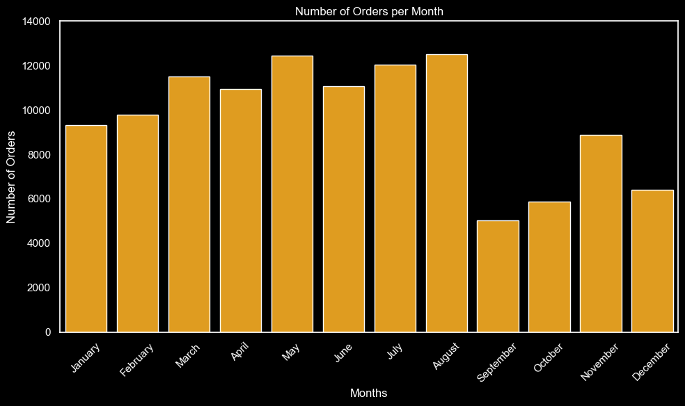
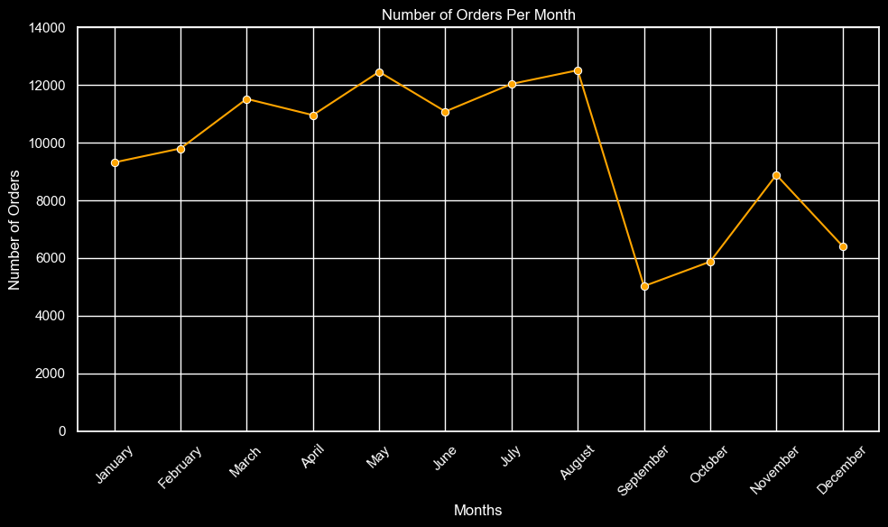
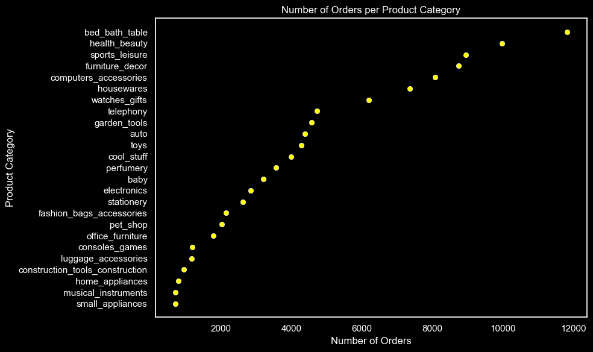
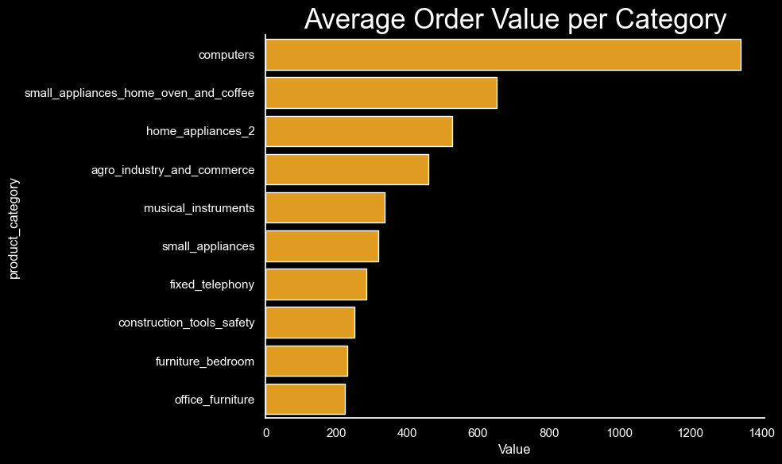
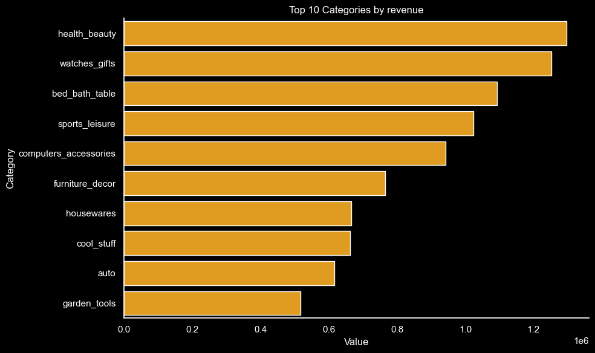
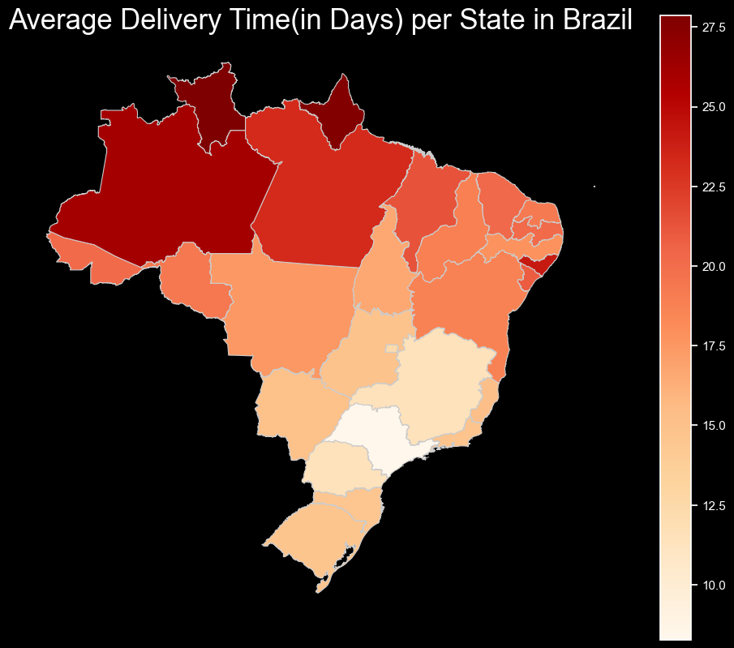
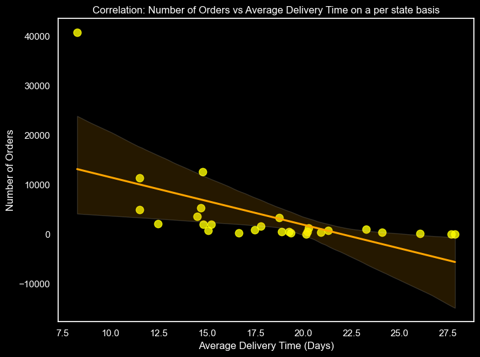
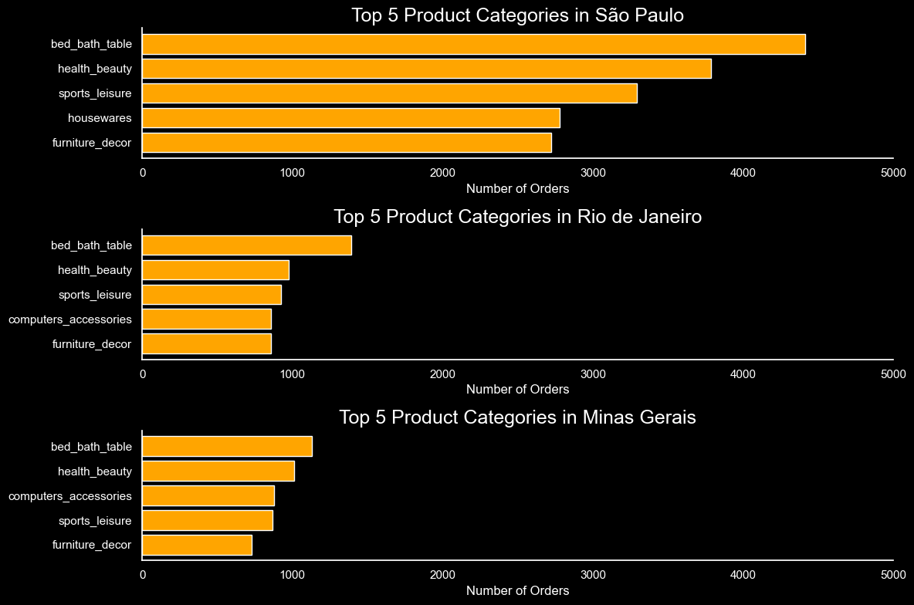

# Overview

### Business Analysis of Olist E-commerce Data

The goal of this project is to perform a comprehensive business analysis of the Olist Brazilian e-commerce dataset to uncover key insights about product categories, revenue, order fulfillment, and logistics efficiency. By leveraging real-world e-commerce data, the project aims to demonstrate my python skills for data cleaning, exploration, visualization, and business storytelling.

# Dataset
The project uses the [Olist Brazilian E-commerce Dataset](https://www.kaggle.com/datasets/olistbr/brazilian-ecommerce) 

which contains multiple relational tables, including:

1. **orders**: Order lifecycle data
2. **customers**: Customer location and identity
3. **order_items**: Item-level pricing and product info
4. **products**: Product categories and dimensions
5. **sellers**: Seller location and identity
6. **geolocation**: Latitude/longitude data
7. **order_reviews**: Customer review scores and comments
8. **order_payments**: Payment type and value

# 📌 Key Questions Addressed

1. What are the **Monthly Order Trends**?

2. What are the **Number of Orders** per **product category**?

3. What is the **Average Order Value** of **Top 10 most selling product categories**?

4. Which **product categories** generate the most **revenue**?

5. What it the **Avg Delivery Time **per **State**?

6. What is the **correlation** Between **Number of orders** & **Delivery Time per State**?

7. What are the **Top 3 States** (as per order order volume) and their **Top 5 Best Selling Product Categories?**

# Techniques & Tools Used

**Data Preprocessing**: Merging multiple CSVs, handling null values, converting date columns

**Exploratory Data Analysis** **(EDA)**: Using pandas, seaborn, and matplotlib for univariate and multivariate analysis

**Data Visualization**:
- **Bar charts** & **line charts** for category-wise **AOV**
- **Correlation plots** between **delivery time** and **order volume**
- **Choropleth map** for state-wise average delivery time.
- **Geospatial Analysis**: Using GeoPandas to visualize delivery patterns across Brazil

# The Analysis

## 1. What are the **Monthly Order Trends**?
Analyzing monthly order trends reveals seasonal patterns and shifts in consumer demand. It helps identify peak shopping periods, slow seasons, and overall growth or decline in order volume. These insights support better forecasting, targeted promotions, and smarter inventory and supply chain planning.

# Visualize Data

# Insights
### High Order Volume Months
- May, July, and August have the highest number of orders, each exceeding 12,000.

- These months likely correspond to peak shopping seasons—possibly influenced by mid-year sales, promotions, or holidays.

### Low Order Volume Months
- September has the lowest order volume, followed by October and December.

- This drop could be due to seasonal slowdowns or consumer spending fatigue after mid-year shopping peaks.

### Gradual Trends
- There is a steady rise in orders from January to August, indicating growing consumer engagement in the first half of the year.

- A sharp drop follows in September, breaking the upward trend.

- November shows a brief recovery, possibly linked to Black Friday or holiday shopping kickoff.

### Business Implications
- Promotions and inventory stocking should be prioritized from March to August to capitalize on high demand.

- September–October may be ideal for operational improvements, system upgrades, or experimenting with new marketing tactics due to lower traffic.

- November could benefit from targeted campaigns (e.g., holiday pre-sales).

# 2. What are the **Number of Orders** per **product category**? (Top 25)
This analysis identifies how many orders were placed in each product category. It helps highlight the most popular categories, understand customer preferences, and spot low-performing segments. These insights can guide decisions around inventory planning, category promotions, and merchandising strategy.

# Visualize Data

# Insights
**Clear Identification of Top Performers**: The categories at the top of the chart are bed_bath_table, health_beauty, sports_leisure, furniture_decor, computers_accessories

**Identification of Underperformers:** Conversely, the categories at the bottom of the chart (e.g., small_appliances, musical_instruments, home_appliances, construction_tools_construction) 

**Significant Disparity in Performance**: The wide spread of the yellow markers along the "Number of Orders" axis clearly illustrates a substantial difference between the most and least popular categories. This suggests that a small number of categories contribute 

## Opportunities for Strategic Focus:

- **Investment & Promotion**: Focus marketing efforts, inventory management, and potentially new product development on the top-selling categories to capitalize on existing demand.

- **Review & Re-evaluation**: For the bottom-selling categories, it's crucial to investigate the reasons for low sales. 

- This could involve:
  * **Market Demand**: Is there sufficient demand for these products?
  * **Marketing Effectiveness**: Are these products being adequately promoted?
  * **Pricing**: Is the pricing competitive?
  * **Product Offering**: Are the products meeting customer needs?
  * **Feasibility**: Consider whether to discontinue certain products or categories if they are consistently underperforming and not strategically vital.

# 3. What is the **Average Order Value** of **Top 10 most selling product categories**?

# Visualize Data

# Insights
**High-Value Categories**: The "computers" category clearly has the highest Average Order Value, significantly surpassing all other categories. This suggests that when customers buy computers, they tend to spend a much larger amount per order.

  * computers: Approximately 1300 (highest AOV)
  * small_appliances_home_oven_and_coffee: Around 700
  * home_appliances_2: Around 550

**Mid-Range AOV Categories**: Categories like small_appliances_home_oven_and_coffee, home_appliances_2, and agro_industry_and_commerce represent a middle tier in terms of average spending per order. These are still valuable, but not as high as computers.

**Lower AOV Categories (Among the Top 10)**: Categories like office_furniture, furniture_bedroom, construction_tools_safety, and fixed_telephony have comparatively lower average order values, hovering around 200-300. While they might be top-selling in terms of number of orders, their individual transaction value is lower.

## Strategic Implications for Marketing and Sales:

  * **Targeting High-Value Customers**: For categories with high AOV (like "computers"), focus marketing efforts on upselling and cross-selling premium accessories or related services. These customers are willing to spend more.

  * **Maximizing Volume in Lower AOV Categories**: For categories with lower AOV, but potentially high sales volume (afterall these are among the Top 10 most selling items), the strategy might shift to increasing the number of orders, bundle promotions, or loyalty programs to encourage repeat purchases.

  * **Product Bundling Opportunities**: Explore bundling lower AOV items with higher AOV items (e.g., offer a discount on "office_furniture" when purchasing "computers").

# 4. Which **product categories** generate the most **revenue**?
The aim is to identify the product groups that contribute the most significant financial earnings to the business. This insight is crucial for understanding the primary drivers of income, allocating resources effectively, and prioritizing growth strategies.

# Visualize Data

# Insights
**Dominant Revenue Generators**: **health_beauty** and **watches_gifts** are the two highest revenue-generating categories, each contributing over **$1.2 million**. This indicates they are the most valuable segments in terms of financial income.

**Strong Contributors**: **bed_bath_table** and **sports_leisure** are also very strong performers, generating over $1 million each. These, along with the top two, form the core of the business's revenue stream.

**Mid-Tier Revenue Categories**: **computers_accessories**, **furniture_decor**, **housewares**, **cool_stuff**, and **auto** contribute substantial, but relatively less, revenue compared to the top four. Their contributions range roughly from **$0.6 million** to **$0.9 million**.

**Lower-End of Top 10**: **garden_tools** is at the bottom of this top 10 list, generating just over **$0.5 million**. While it's in the top 10, its revenue contribution is significantly less than the leading categories.

**Revenue Concentration**: The graph clearly shows a concentration of revenue in the top few categories. The drop-off in revenue contribution is quite noticeable as you move down the list from **health_beauty** to **garden_tools**. This highlights the importance of these top categories to the business's financial health.

**Strategic Focus**:
  * **Investment Priority**: The top revenue-generating categories **(health_beauty, watches_gifts, bed_bath_table, sports_leisure)** should be prioritized for inventory management, marketing campaigns, and customer retention efforts, as they are the primary drivers of income.
  
  * **Growth Opportunities**: For categories like  **computers_accessories** and **furniture_decor**, there might be opportunities to boost their revenue contribution through targeted promotions or expanding product lines.

  * **Efficiency Review**: While garden_tools is in the top 10, its relatively lower revenue compared to others might warrant an efficiency review to ensure it's still optimally managed or if there are ways to increase its sales.

# 5. What it the **Avg Delivery Time **per **State**?
The aim is to analyze how long it takes for products to be delivered to customers in different states. This insight is essential for evaluating logistical efficiency, identifying regions with potential delivery bottlenecks, and informing customer service expectations.

# Visualize Data

# Insights

**Regional Differences in Delivery Time**: The map clearly highlights significant variations in average delivery times across different Brazilian states. The color intensity directly correlates with the delivery duration.

**Areas with Longest Delivery Times (Red/Darker Shades)**:

  * States in the Northern and Northwestern regions (e.g., Amazonas, Roraima, Amapá, Pará, Acre) show the darkest red shades, indicating average delivery times of 25.0 to 27.5 days. These are the regions with the longest delivery durations.

  * This suggests potential challenges in logistics, infrastructure, or accessibility to these more remote areas of Brazil.

**Areas with Shortest Delivery Times (Light Orange/White Shades)**:

  * States predominantly in the Southern and Southeastern regions (e.g., parts of São Paulo, Paraná, Santa Catarina, Rio Grande do Sul) exhibit lighter shades, indicating average delivery times between 10.0 and 12.5 days. These areas benefit from faster delivery.

  * This likely corresponds to areas with better transportation networks, higher population density, and closer proximity to distribution centers.

**Gradual Spectrum**: There's a clear gradient from faster delivery times in the south to slower times in the north, indicating a regional pattern rather than isolated incidents.

**Strategic Implications for Logistics and Customer Service:**

  * **Resource Allocation**: Companies can use this insight to strategically allocate logistics resources. More investment in improving delivery infrastructure (e.g., new distribution centers, partnerships with local carriers) might be needed in the slower-delivery regions.

  * **Customer Expectation Management**: For customers in states with longer average delivery times, it's crucial to set realistic expectations upfront to avoid dissatisfaction. This could involve clearer communication during purchase or offering alternative, potentially faster, (but higher-cost) shipping options.

  * **Market Expansion Considerations**: When considering market expansion, states with shorter delivery times might be easier to penetrate due to better customer experience, while states with longer times might require a more robust and localized delivery strategy.

  * **Cost Analysis**: Longer delivery times can sometimes correlate with higher shipping costs. The business can analyze if these regions are less profitable due to increased logistical expenses.

  * **Competitive Advantage**: If competitors also face similar challenges in slow-delivery regions, improving delivery times there could provide a significant competitive advantage.

# 6. What is the **correlation** Between **Delivery Time** & **Number of orders** per State**?

# Visualize Data

# Insights
**Moderate Negative Correlation**: The correlation coefficient of **-0.583** indicates a moderate negative correlation between the average delivery time and the number of orders per state. This means that as the average delivery time in a state increases, the number of orders tends to decrease, and conversely, states with shorter average delivery times tend to have more orders.

**Impact of Delivery Speed on Order Volume**: States that boast quicker delivery times generally see a higher volume of orders. This strongly suggests that faster delivery is a contributing factor to, or at least associated with, higher customer activity and order frequency.

**Identifiable Outlier (Opportunity for Investigation)**: There's a clear outlier in the top-left corner. This state has a remarkably low average delivery time (around 8-9 days) but an exceptionally high number of orders (over 40,000).

  * **Business Insight from Outlier**: This specific state is a model of efficiency and success. It's crucial to understand why this state performs so well in terms of both speed and volume. Can its best practices in logistics, supply chain management, or regional marketing be replicated in other areas? This represents a significant learning and scaling opportunity.

**Strategic Implications:**

  * **Prioritize Delivery Time Improvement**: Focusing efforts on reducing average delivery times, especially in states currently experiencing longer delays, could directly lead to an increase in order volumes and improved customer satisfaction.

  * **Investment in Logistics**: Consider investing in infrastructure or operational improvements in states with high delivery times to boost their order potential.

  * **Marketing and Customer Expectations**: Use faster delivery times as a key selling point in regions where it's achievable. For regions with longer times, manage customer expectations proactively and transparently.

# 7. What are the **Top 3 States** (as per order order volume) and their **Top 5 Best Selling Product Categories?**

# Visualize Data

# Insights

**Identification of Top States**: **São Paulo**, **Rio de Janeiro**, and **Minas Gerais** are the top 3 states by order volume. 

**Consistent Core Categories**: Across all three top states, there's a remarkable consistency in the top product categories:

  * bed_bath_table
  * health_beauty
  * sports_leisure
  * furniture_decor 
  
  These categories consistently appear in the top 5 for each state, indicating they are universally popular and essential product lines for the business in these key regions. This suggests a strong foundation for these product categories nationwide.

**State-Specific Category Nuances**: While there's consistency, there are subtle differences revealing regional preferences:

  * **São Paulo**: Shows a very strong demand for **bed_bath_table** (over 4000 orders), with **health_beauty** also performing exceptionally well. **housewares** appears in its top 5, replacing **computers_accessories** seen in other states. This implies a significant market for **home-related goods in São Paulo.**

  * **Rio de Janeiro**: Has a similar top 4 to **São Paulo**, but **computers_accessories** replaces **housewares**. The overall order volumes for the top categories are significantly lower than **São Paulo**.

  * **Minas Gerais**: Also features **computers_accessories** prominently in its top 5, like **Rio de Janeiro**, but unlike **São Paulo**. The order volumes here are similar to **Rio de Janeiro**, indicating a consistent demand profile across these two states, but at a lower scale than **São Paulo**.

**São Paulo's Market Dominance (Volume)**: **São Paulo's** top categories consistently show much higher order volumes (e.g., **bed_bath_table** with over **4000 orders**) compared to **Rio de Janeiro** and **Minas Gerais** (where top categories hover around **1000-1500 orders**). This reinforces **São Paulo** as the largest and most lucrative market by order volume.

**Strategic Implications:**

  * **Tailored Marketing**: While the core categories are consistent, marketing efforts can be slightly tailored. For **São Paulo**, emphasizing **housewares** alongside the other top categories could be beneficial. For **Rio de Janeiro** and **Minas Gerais**, **computers_accessories** is a more relevant focus within their top 5.

  * **Inventory Management**: Inventory allocation should heavily favor **São Paulo** due to its higher order volumes across all top categories. Inventory for **housewares** might be prioritized for **São Paulo**, while **computers_accessories** could see proportional distribution across **Rio** and **Minas Gerais**.

 * **Regional Growth Initiatives**: Understanding these specific preferences can help in developing targeted growth strategies for each state, such as launching new products that align with their specific top categories or running promotions that resonate with regional demands.

 * **Logistics Optimization**: Knowing the top categories in each top state helps logistics planning. Ensuring efficient delivery for **bed_bath_table** and **health_beauty** is paramount across all three, but specific attention to **housewares** in **São Paulo** or **computers_accessories** in **Rio** and **Minas Gerais**. is also warranted.

# Conclusion

- This project analyzed [Olist’s e-commerce data](https://www.kaggle.com/datasets/olistbr/brazilian-ecommerce) to uncover key trends in customer behavior, delivery performance, and product category value. 

- **Key Performance Indicators Identified**: Clearly defined highest-performing product categories by order volume and revenue, along with their average order values.

- **Logistics Impact on Sales**: Demonstrated a significant inverse correlation between average delivery time and order volume per state, highlighting logistical efficiency as a direct sales driver.

- **Regional Market Understanding**: Provided granular insights into the top-performing states and their specific product category preferences.

- **Actionable Strategic Guidance**: The findings are instrumental for optimizing product portfolios, enhancing supply chain logistics, and developing targeted regional strategies.

